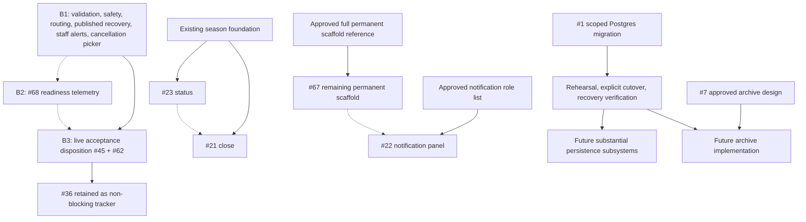

# Ratatoskr backlog execution plan

Version: 2.6 — B5a-B5e shipped; B5f Scout signup boundary in progress
Recorded: September 2, 2026
Updated: September 10, 2026
Repository: [diese-tech/Ratatoskr](https://github.com/diese-tech/Ratatoskr)
Baseline commit: [`866407f3bdca0e26a2ae3b21221d45a96cdc3056`](https://github.com/diese-tech/Ratatoskr/commit/866407f3bdca0e26a2ae3b21221d45a96cdc3056)

## 1. Purpose and status

This is the durable record of the original dependency-aware backlog assessment and the subsequent B1 scope decisions. It is the reference for implementation, review, and acceptance. Keep the sequence and boundaries below intact unless new evidence requires a documented revision.

The audit and versions 1.1–1.2 were documentation only. The user approved B1 implementation, including #69, and requested Done/Validation/Next commits after each meaningful chunk. All seven B1 PRs (#70–#76) are now merged in dependency order, preserving their commits. The B1 boundary is c5945000e5b5836de170b6a5987ad37b9a6a3818. Its main CI and Railway startup checks passed. The original audit snapshot below remains historical; production now contains the merged changes. B1 cumulative validation passed 168 tests, both typechecks, build and dependency audit.

B2's Lucid-inspired telemetry adaptation is separately merged in [PR #77](https://github.com/diese-tech/Ratatoskr/pull/77), at 4ca02d0adb1c39e4d10327f10d1679ef59f6d0d0. All 187 tests and both platform checks passed before merge; Railway deployment and startup/card reconciliation passed afterward. The user explicitly directed auto-deploy to remain enabled and deployment logs to be checked between merges. See `docs/operations/batch-integration.md` for exact evidence.

Issue [#87](https://github.com/diese-tech/Ratatoskr/issues/87) subsequently expanded the Scout lifecycle beyond B2. Its migration-18 foundation and working-roster lifecycle shipped through [PR #88](https://github.com/diese-tech/Ratatoskr/pull/88) and [PR #89](https://github.com/diese-tech/Ratatoskr/pull/89). Live Discord feedback then drove the private-continuation hardening in [PR #91](https://github.com/diese-tech/Ratatoskr/pull/91) and [PR #92](https://github.com/diese-tech/Ratatoskr/pull/92). PR #92 merged as `4317bffa2b3e6796f125bca07e6dd462028cecfb` after 238 local tests, green Ubuntu/Windows CI, and a resolved Half-Shell follow-up. Issue #87 is closed.

On September 7, the user directed that B3 be considered covered for sequencing until new live Discord issues are brought back. This is a product/acceptance disposition, not a claim that every historical #45/#62 checklist step was observed. Issues #36, #45, #62, #68, and #69 remain available as non-blocking trackers. B4a / #23 shipped through PRs #96 and #97; B4b / #21 shipped through PR #99 at `f34b3b7f89884457dab5eb4a62caa97aa5ec1cb8`, with final review and post-merge Ubuntu/Windows CI green. B5a / #100 shipped through PR #101 at `c7b0dc4e0bfb984e5dabfc3bb180a3da12151a68`; B5b / #102 shipped through PR #103 at `5837a72bf81213c33e94d68b36ae99eb9ce9af00`; B5c / #104 shipped through PR #105 at `eda934e84913dcceebcbf843e01c32d3b6de7523`; B5d / #106 shipped through PR #107 at `ab2d526763e45a6bec9603bd0ec52fe577311e00`; B5e / #108 shipped through PR #109 at `8e361e05104837c55df1b6a49a9e7d9845e106ad`. Focused [Issue #110](https://github.com/diese-tech/Ratatoskr/issues/110) is the active B5f Scout-signup slice. The separate three-hour Scout cleanup proposal remains in [#90](https://github.com/diese-tech/Ratatoskr/issues/90) and does not silently enter B5.

## 2. Agreed changes since the original assessment

September 3 follow-up: the user verified recovered B2 cards in Discord and found
that stale postings have no on-card management. Add explicit cancellation and
published completion controls before B3 acceptance; see
[`scout-stale-post-management.md`](scout-stale-post-management.md). This supersedes
B2's status-only open-card decision. B3–B7 ordering and reminder scope stay intact.

That follow-up is merged in PR #79 at `cd1be71284fafc7c69d0058807d046889101238d`.
Its 196-test suite, Windows/Ubuntu PR and main CI, and automatic Railway startup
passed. Recovered-card reconciliation completed at 13:07:07 UTC on September 3.
Staff must still verify the actual cancel/finish interactions on their chosen
postings; no production setup was automatically cancelled or finished.

| Topic | Original plan / observed implementation | Current plan |
| --- | --- | --- |
| Overall sequence | B1 through B7 | B1/B2 shipped; #87 lifecycle and hardening shipped after B2; B3 covered by explicit user direction; B4 shipped; B5 is active |
| B1 | Validation, division recovery, published interaction and result-write safety | Retain original repairs; correct publication routing, add actionable error reporting and direct cancellation selection |
| Division Scout channels | Code provisions signup/results pairs and publishes lineups to results; v1.1 proposed a third channel | Keep exactly two: `scout-signups` and `scout-results`; the third-channel proposal is superseded |
| Published lineup destination | Stored `resultsChannelId` currently represents the lineup channel | Publish a separate roster post in the setup's signup channel; preserve historical message identities and controls |
| Results channel purpose | Conflated with lineups | Players manually post match-result screenshots after matches; no bot score processing in B1 |
| `/scout cancel` | Required division selection before discovering whether it has cancellable setups | Immediately list active, cancellable postings the coordinator can manage across divisions; select a posting, then confirm |
| Operational alerts | Generic response says “Check staff logs”; exceptions go to process logs | Use the existing staff-only `#staff-ops`, with matching error references in private replies and Railway logs |
| New logging channel | `#bot-logs` was considered | Do not add one in B1; use `#staff-ops` |
| Scout control channel | Shared `#scout-ops` | B2 adds immediate status cards and retains live telemetry in the fresh ready panel through review; closure leaves a historical snapshot |
| Lucid adoption | Lucid has an existing persistent staff card; detailed telemetry remains its open issue #30 | Adopt persistent visibility and diagnostics while retaining Ratatoskr's fresh creator notification and setup/division routing |
| Reminder pings | Previously manual; one-hour follow-up helped coordinators sort availability | #87 superseded the old proposal with durable T-30 and manual roster reminders; #90 separately owns possible three-hour automatic cancel/finish cleanup |

The screenshots show the current channel layout and an error after attempting a published swap. They do not prove who renamed a channel or identify the exact production exception. The current code itself intentionally provisions two division Scout channels and routes lineups to its results destination. Verify live identities and message history before deciding which resource to adopt or rename.

The user's later admin-team decision supersedes v1.1's signups/rosters/results separation. Keep the existing channel pair and change where the bot publishes rosters. The revision history retains the earlier proposal for context only; it is no longer an implementation instruction.

## 3. Original repository assessment

### Architecture and established patterns

- TypeScript/Node.js bot using discord.js; one configured guild and a single-process operating assumption.
- Commands delegate to application services; deterministic roster matching and supporting domain rules are separate functions.
- SQLite through `better-sqlite3`, with 14 migrations, foreign keys, partial unique indexes, conditional updates, and setup-level roster versions.
- Managed Discord resources use authored logical keys and stored Discord IDs. Names are presentation; resource ownership must not be inferred merely from a matching name or absence from a template.
- Scout setups snapshot routing and persist signup/result/control message identities. Optional Fill, eligibility roles, one/two-game rosters, publication, replacements, cancellation, and several restart-recovery paths exist.
- `ADMIN` uses configured role IDs. Scout access additionally uses division manager/captain roles and additional authorized staff; some current role resolution still relies on names.
- Server bootstrap has a deliberate native-Administrator exception. Do not extend that exception to other commands.
- Railway deployment records are associated with GitHub commits. The application opens/migrates its database before Discord login.

### Verification from the audit

| Evidence | Result | Limit |
| --- | --- | --- |
| Local suite on Node 24 | 133 tests passed | Existing tests miss several external-failure cases |
| Application and script typechecks | Passed | Does not prove runtime behavior |
| Build configuration with no output emitted | Passed | Current CI also performs the actual build |
| Dependency audit | Zero reported vulnerabilities | Does not establish runtime support or application correctness |
| Baseline main CI | 116 tests passed | Linux shell expansion omits 17 nested repository tests |
| Railway deployment record | Baseline commit reported success on September 1 | Does not prove current runtime, migrations, volume contents, or real Discord interactions |
| Live guild acceptance / production DB and logs | Not directly inspected | Still required in the release/acceptance workflow |

The validation results above are audit evidence, not tests rerun by the documentation task. The baseline SHA and open backlog were refreshed when this plan was recorded.

[Baseline CI run](https://github.com/diese-tech/Ratatoskr/actions/runs/33521180874) · [PR #66](https://github.com/diese-tech/Ratatoskr/pull/66) · [Railway deployment record](https://api.github.com/repos/diese-tech/Ratatoskr/deployments/6203674241/statuses)

### Material constraints and debt

- Database objects cross command/service boundaries; Postgres needs an intentional asynchronous storage boundary.
- Process-local locks do not protect multiple replicas. A database migration must not silently enable multiple bot replicas.
- Operational logging is console-based; there is no durable application audit subsystem.
- Startup recovery is not an application readiness signal. Shutdown does not explicitly drain all in-flight workflows before closing the database.
- A writable but nonpersistent database path can create a fresh SQLite database. An incorrect/missing volume mount is not necessarily detected by successfully opening the file.
- No enforced main branch protection was reported during the audit.
- Documentation and several issue descriptions lag the implemented Scout and season contracts.

## 4. Original backlog health and complete issue matrix

The table below retains the original audited issue set and adds subsequent Scout work. States and sequencing were refreshed on September 7; open tracker status is not treated as a blocker unless the current plan says so.

“Ready” below means sufficiently scoped after the noted corrections, not complete. Risk is implementation/acceptance risk. Batch positions refer to section 6; B1 subsections refer to section 7.

| Issue | Status / relevant implementation | Subsystems and dependencies | Unlocks | Risk | Action and position |
| --- | --- | --- | --- | --- | --- |
| [#1 — Roadmap: Ratatoskr MVP and YSL league-ops foundation](https://github.com/diese-tech/Ratatoskr/issues/1) | Partially implemented; stale checklist; latest comment requests dedicated Ratatoskr Postgres | Persistence, config, deployment, recovery; requires scoped storage contract and migration rehearsal | Future substantial durable subsystems | High | Keep roadmap; extract bounded migration workstream for B5; update inventory alongside work |
| [#7 — Design historical division archive pipeline and season yearbook exports](https://github.com/diese-tech/Ratatoskr/issues/7) | Design remains open; current archive changes visibility, with no export jobs | Export worker, historical attribution, storage, privacy, lifecycle; decisions required | Later archive implementation | High for implementation | Keep canonical design issue; collect decisions earlier and complete design in B7; do not implement exporter under design acceptance |
| [#21 — Season Close: /season close and the active-season lifecycle](https://github.com/diese-tech/Ratatoskr/issues/21) | Ready; archived status/timestamp and transactional season primitives exist | Season persistence and admin authorization; existing foundation sufficient | Creation of the next season | Medium | B4b, narrow transition; group milestone with #23, separate coherent change |
| [#22 — Self-Assignable Notification Roles via #role-select](https://github.com/diese-tech/Ratatoskr/issues/22) | Channel and component routing exist; role panel absent; actual role list undecided | Role identity/hierarchy, component authorization, panel persistence; coordinate #67 | Member notification opt-in | Medium | B6b after #67; confirm role list, reuse current routing and provisioning |
| [#23 — /season status: inspect the current season workspace](https://github.com/diese-tech/Ratatoskr/issues/23) | Ready after correcting six-channel criterion to five; queries/key helpers exist | Read-only season and managed-resource inspection | Better season diagnosis and #21 verification | Low | B4a; never repair or provision from status |
| [#24 — Product Scope: full command surface for v1 + future web admin panel](https://github.com/diese-tech/Ratatoskr/issues/24) | Reference-only; command/access inventory stale | Product scope and architectural ownership | Future separately approved features | Low | Retain reference tracker; refresh alongside batches; no web panel implementation |
| [#36 — Preseason scout setup workflow](https://github.com/diese-tech/Ratatoskr/issues/36) | Scout lifecycle is implemented and materially expanded through #87; tracker remains open | Scout umbrella and future live issue intake | Verified Scout completion | Deferred acceptance risk | Retain as a non-blocking umbrella; do not claim every historical live criterion was observed |
| [#45 — Complete live Discord scout acceptance and deployment](https://github.com/diese-tech/Ratatoskr/issues/45) | Deployment and partial live evidence exist; full historical checklist was not completed | Real permissions, routing, migration/volume, interaction and restart behavior | #36 acceptance | Deferred by user | Keep open as a non-blocking live-regression tracker; resume only when requested or new evidence arrives |
| [#62 — Live-verify eligibility, Fill, overlap, and two-game scout flows](https://github.com/diese-tech/Ratatoskr/issues/62) | Automated coverage is extensive and partial live interaction evidence exists; the full 20-player session was not completed | Eligibility, Fill, overlap, two-game management and recovery | Expanded Scout acceptance | Deferred by user | Keep open as a non-blocking live-regression tracker; resume only when requested or new evidence arrives |
| [#67 — Refresh the permanent YSL server bootstrap scaffold](https://github.com/diese-tech/Ratatoskr/issues/67) | Existing reconciler is reusable; requested rename/move/order behavior incomplete; full live reference missing | Managed identities, permissions, bootstrap reconciliation; complete approved inventory needed | Repeatable permanent setup and #22 | High | Minimal required-role repair in B1.2; division channel correction in B1.3; full permanent refresh remains B6a |
| [#68 — Priority: Add live scout signup readiness telemetry](https://github.com/diese-tech/Ratatoskr/issues/68) | B2 shipped in PR #77 and later working-roster work expanded the same operator surface | Canonical eligibility events, setup serialization, durable message lifecycle | Staff visibility into readiness | Low residual | Keep open as a non-blocking tracker under the B3 disposition |
| [#69 — Fix replacement slot labels and verify multi-game replacement flow](https://github.com/diese-tech/Ratatoskr/issues/69) | Readable selection shipped in B1.7; #87 and #91/#92 added broader multi-step and two-game regression coverage | Name lookup, interaction timing, single/two-game selection | Readable selectors and stronger #62 coverage | Low residual | Keep open as a non-blocking tracker under the B3 disposition |
| [#87 — Improve Scout Ops lifecycle](https://github.com/diese-tech/Ratatoskr/issues/87) | Closed; migration-18 foundation, working roster, coordination, reminders, availability, replacement and finish lifecycle shipped in PRs #88/#89; private continuations hardened in #91/#92 | Scout persistence, roster, coordination, notifications, recovery and Discord interactions | Complete working Scout lifecycle | Shipped | Preserve as the authoritative shipped product specification; route new defects to focused issues |

Research and engineering requirements map to each issue in section 10. Shared infrastructure is limited to observed repeated needs: complete test discovery, managed-resource identity resolution, recoverable published writes, a small error reporter, and the later asynchronous storage boundary.

## 5. Dependency graph and ordering rules



Solid arrows are prerequisites. Dotted arrows are recommended sequencing, not invented hard dependencies.

- Postgres is not required for B1 repairs, #69, #68, #23, or #21.
- #23 is useful before #21, but closing a season does not technically depend on the status command.
- #7 design can advance before Postgres is deployed; later substantial archive persistence should use the approved storage foundation.
- Full #67 is not required for acceptance on an already configured guild. Its required-role defect and the agreed division Scout contract correction belong earlier in B1.
- #22 can reuse its existing channel; completing #67 first avoids repeated role/channel reconciliation changes.
- Preserve season-independent Scouts and one setup owning both games. Do not introduce regular-season scores into the Scout roster model.
- If implementation disproves an assumption, revise this plan before adding downstream work. Record the evidence and affected dependencies rather than silently broadening scope.

## 6. Original B1–B7 execution sequence, retained

| Order | Batch | Scope | Exit gate |
| --- | --- | --- | --- |
| 1 | B1 — release verification and Scout recovery | Original validation/division/published-write repairs, plus signup-channel publication, staff-ops reporting and direct cancellation selection | Complete automated gates and review; operational changes prepared with a concrete migration/verification path |
| 2 | B2 — Scout readiness visibility | #68 live readiness telemetry; #69 moved into B1.7 | Canonical counts; durable telemetry-to-control-panel lifecycle |
| 3 | B3 — live Scout acceptance (covered by user direction) | Historical #45/#62 coordinated-session checklist retained for future issue intake | No longer blocks sequencing; do not represent the unperformed remainder as observed live evidence |
| 4 | B4 — season lifecycle (shipped) | #23 status, then #21 close | Five-channel inspection is read-only; confirmed close archives exactly the intended season, leaves zero active seasons, preserves channels and Scouts |
| 5 | **B5 — Postgres migration (active)** | Scoped workstream extracted from #1; B5a in #100, B5b in #102, B5c in #104, B5d in #106 | Verified schema/data/invariants, rehearsed cutover and recovery, one replica, post-cutover Scout smoke tests |
| 6 | B6 — permanent scaffold and notification roles | Remaining full #67, then #22 | Approved fresh/upgrade layout preserves identities/history; notification roles cannot grant access |
| 7 | B7 — archive design | #7 design only | Explicit storage/export/privacy/attribution/failure decisions and acceptance-ready implementation prerequisites |

Update #1/#24 and stale criteria alongside the relevant batch. Do not delay a safe unblocked slice merely because a separate product reference is unavailable. Keep any departure from the preferred order visible in the decision log.

## 7. Updated B1 implementation contract

Implement B1 in seven reviewable slices, preferably separate PRs in this order. B1.3 replaces the superseded third-channel proposal; B1.6 adds the cancellation picker and B1.7 moves #69 readable names into B1. B1.1, B1.2, B1.4 and B1.5 retain their existing purpose, and B2–B7 retain their order. Names below are planning labels, not existing GitHub issue or PR numbers. Re-read relevant issues/current main before each slice. Keep any required migrations append-only and ordered across the slices.

### B1.1 — Trustworthy validation and supported runtime

**Problem:** Windows discovers 133 tests while baseline Linux CI discovers 116. The omitted 17 tests protect nested repositories, restart isolation, and versioned state changes. CI also pins Node 20, which is EOL.

**Implementation:**

- Make test discovery explicit and cross-platform so nested test files run in Linux CI and locally.
- Align application/CI runtime expectations on supported Node 24 LTS; verify the native SQLite dependency on the actual build environment.
- Preserve the lockfile and avoid unrelated package upgrades.
- Check actual Railway runtime configuration before changing production; do not claim deployment parity from package metadata alone.

**Acceptance:**

- [ ] All existing 133 baseline tests, plus added regressions, run in Linux CI; file/test coverage is verified rather than assuming an unchanged count is sufficient forever.
- [ ] Application typecheck, script typecheck, actual build, tests, and dependency audit pass.
- [ ] Native SQLite loading and migrations pass under the supported target runtime.
- [ ] Runtime requirements and operator validation steps are documented.

### B1.2 — Division provisioning and teardown safety

**Problems:** Fresh bootstrap omits the required `Franchise Representative` role; interrupted Discord channel moves can leave an unrepaired stored parent; pending Scout work does not reliably block division teardown.

**Implementation:**

- Create/adopt the already-required franchise representative role through managed-resource identity; reject ambiguity and resolve its use consistently. Do not silently reinterpret an unrelated `Org Owner` role as equivalent.
- Repair the stored parent when it disagrees with the confirmed live parent, independently of whether Discord still needs a move.
- Block archive/delete while a setup is posting or publication remains unresolved, in addition to existing open/roster-ready blockers.
- Audit the create/publish/teardown interleavings and use the smallest necessary coordination to prevent removing channels beneath an in-flight operation.
- Keep fully settled published/cancelled behavior compatible with the existing lifecycle contract unless an explicit change is agreed.

**Acceptance:**

- [ ] Fresh scaffold can provision a division without an undocumented manual role prerequisite.
- [ ] Ambiguous role identity fails closed before related permission mutations.
- [ ] Retry repairs “Discord moved, database still old” without creating duplicate channels or losing history.
- [ ] Pending creation/publication prevents destructive teardown and identifies the blocking setup.
- [ ] Concurrent create/publish versus teardown and existing division isolation are tested.

### B1.3 — Two-channel Scout workflow and publication routing

**Agreed layout:**

```text
Scout Operations
  #scout-ops                         shared setup controls
  #<division>-scout-signups          signup posts, then published roster posts
  #<division>-scout-results          players' match-result screenshots
```

Each division retains its two channels through `/division add`. A published roster is a separate bot message in the same channel as its signup post; the original signup post remains and closes to further signups through the existing publication lifecycle. Subsequent swaps/replacements edit that roster and post their notices in its channel. Players manually post screenshots in results after matches. The permanent bootstrap owns the shared operations area; it must not pre-create every division's channels. The full permanent category refresh remains B6.

**Implementation:**

1. Inspect managed IDs, setup snapshots and pending/published message records. Preserve the existing signup/results channel IDs, logical keys and history; no channel rename or third-channel creation is required by this contract.
2. Route new setups' roster publications to their snapshotted signup channel. Safely update unpublished setups with no claimed/in-flight publication so their first roster also lands in signups; use state/version checks and coordinate the rollout with pending work.
3. Make the distinction between the roster-message destination and the manual screenshot channel explicit in code. Existing `results_channel_id` / `resultsChannelId` values currently identify the bot's lineup destination. Preserve their historical meaning when reading old records; use a narrow naming/translation change and only the append-only migration actually needed.
4. Keep already-published rosters at their original message/channel IDs. Their controls, edits and notices must continue to target those original messages. Do not move, delete, recreate or duplicate historical rosters merely to apply the new layout retroactively.
5. Reconcile an already-claimed or ambiguous publication at its persisted destination before any routing change. Do not overwrite a pending target and risk a second roster in signups. These legacy operations may settle in their original results channel; document this transition exception explicitly.
6. Update channel resolution, publication/recovery, swap/replacement authorization, links, help and operational docs for signup and roster messages sharing a channel. Keep distinct message IDs/markers and dispatch reactions to the signup message only. Absence of the manual screenshot channel must not prevent an otherwise valid roster publication to signups.
7. Validate bot send/edit/reaction permissions in signups and player view/send/attachment permissions in results while preserving division access rules. Do not add screenshot ingestion, scoring or automatic match-result posts. Preserve legacy bot editing access where historical rosters still need it.
8. Re-running provisioning must converge to the same two IDs, preserve unmanaged content and create no duplicate channels or posts.

**Acceptance:**

- [ ] Fresh provisioning produces exactly two managed Scout channels per division plus the shared operations channel; no `scout-rosters` is added.
- [ ] New publications and safely transitioned unpublished setups place a separate roster post in their signup channel; the original signup post closes correctly.
- [ ] Upgrade preserves both existing channel IDs, all messages and their links.
- [ ] Existing published and interrupted setups reconcile at their persisted destinations after restart without duplicate publication.
- [ ] Existing replacement/swap controls still address their original setup/message and exact game/team/role slot.
- [ ] Swaps, replacements and notices for rosters published under the new routing remain in signups; legacy roster maintenance retains its original destination.
- [ ] Player screenshots can be posted in results without a bot submission or processing workflow.
- [ ] Signup reactions are tied to the signup message; roster messages sharing its channel do not become signup inputs.
- [ ] Manual-results channel unavailability does not redirect or unnecessarily block publication to a valid signup channel.
- [ ] Repeated provisioning and partial-failure retry create no duplicates and preserve unmanaged content.
- [ ] Permission tests preserve division isolation and intended manager/captain/staff authority.
- [ ] Routing transition/rollback notes distinguish unpublished, pending and already-published setups; no unverified bulk rerouting occurs.

### B1.4 — Published swaps and durable roster-message updates

**Problems:** Published Swap defers an interaction then attempts a second initial reply. Published edits also lack complete recovery when the process exits between database mutation and Discord edit, or when Discord accepts an edit but its response is lost.

**Implementation:**

- Acknowledge each interaction exactly once using the correct private-response flow. Keep slow lookups and external work within the acknowledged interaction lifecycle.
- Preserve authorization, setup/channel scope, slot identity and expected-version checks for every mutation.
- Persist enough pending operation state to reconcile stored rosters, Discord message content and controls after crashes or ambiguous API responses.
- Do not treat every rejected edit promise as proof that Discord made no change.
- Serialize conflicting published writes as required and define how pending notices are recovered or surfaced without duplicate notifications.
- Keep the solution scoped to Scout writes; do not introduce a generic queue, Redis service, or full transaction framework.

**Acceptance:**

- [ ] Published Swap opens the private selector without `InteractionAlreadyReplied`.
- [ ] One-game and two-game swaps/replacements affect only the selected setup and slots.
- [ ] Stale/replayed/unauthorized actions cannot overwrite newer state or cross division boundaries.
- [ ] Failure injection covers crashes before/after database mutation, before/after Discord edit, and lost success responses.
- [ ] Restart reconciliation brings message content, controls and canonical roster state into agreement.
- [ ] User responses distinguish complete success, no change, pending recovery and partial success accurately.
- [ ] Existing marker/identity protections and explicit mention controls remain intact.

### B1.5 — Actionable operational errors in existing staff-ops

**Agreed destination:** Use the existing staff-only `#staff-ops`. Do not create `#bot-logs` or route technical errors into public division channels. Keep detailed technical logs in Railway.

**Implementation:**

- Resolve the intended staff-ops destination by managed ID, with an explicit admin binding only if needed; do not take an arbitrary same-named channel.
- Validate guild, privacy and bot send permissions. A runtime error must not trigger automatic channel creation or permission rewrites.
- Give failures a correlation/error reference shared between the private user response, safe staff report and detailed structured process log.
- Include the action, division/setup when relevant, timestamp, safe failure summary and an actionable next step. Describe known partial success or pending recovery.
- Cover command/component failures and actionable Scout reaction/reconciliation failures using a small shared reporter.
- Suppress unwanted mentions, redact secrets/raw sensitive payloads and limit repeated alerts. Normal activity should not flood staff coordination.
- Logging failures must not replace the original error, recursively report themselves, or cause a second user-operation failure.
- If staff-ops is missing/inaccessible or a report cannot be delivered, retain the detailed process log and provide truthful fallback guidance; do not claim staff were notified or direct users to nonexistent logs.

**Acceptance:**

- [ ] A forced swap failure creates a private response and a staff-only report with the same reference as its Railway log.
- [ ] Reports identify the affected operation and setup without exposing credentials or unnecessary personal data.
- [ ] Missing channel, ambiguous binding, permission denial, API failure and repeated-error cases are tested.
- [ ] Failure of the reporter does not change canonical roster state or trigger recursive failures.
- [ ] Operators can find the relevant deployment log using the reference and know whether retry is safe.

### B1.6 — Direct active-posting selection for `/scout cancel`

**Problem:** The command requires a division before listing open/roster-ready setups, so coordinators can choose an empty division and hit a dead end. A posting picker and confirmation already exist within a selected division.

**Agreed flow:** Run `/scout cancel` in `#scout-ops` → private list of active cancellable postings the coordinator can manage → choose a posting → confirm cancellation. No required division selection. `/scout create` retains its division choice.

**Implementation:**

- Remove the required division option from cancellation and update command registration/help. Query actual setup records across the current guild's active divisions, filtered through the existing per-division management policy.
- List `open` and `roster_ready` setups. Preserve the existing cancellation lifecycle: published, cancelled and unresolved `posting` setups are not selectable. Teardown blockers in B1.2 remain broader than this user-facing cancellation list.
- Identify each posting with division, scheduled date/time in the configured Scout timezone, status and a stable setup ID; sort by scheduled time, then ID. Include the original signup link in the confirmation when available.
- Show the picker even for one eligible posting for a consistent flow. If none are available, say “There are no active scout postings you can cancel.” Paginate when necessary rather than silently dropping postings beyond a menu's capacity.
- Recheck guild, operations-channel scope, member access, setup state and expected version on selection/confirmation. A picker opened before publication, cancellation or a permission change must not authorize a stale mutation. Preserve older durable cancel controls during rollout.
- Reuse the existing confirmation, conditional cancellation and signup/control-panel reconciliation. Selection alone never cancels a setup, and cancellation never deletes its history. Refresh unavailable selections with clear guidance.

**Acceptance:**

- [ ] `/scout cancel` lists eligible postings directly without a division argument or an empty-division dead end.
- [ ] Each entry distinguishes division, time and status; two concurrent divisions and multiple postings in one division are unambiguous.
- [ ] Only postings the caller can manage are listed, and authorization is rechecked before any mutation.
- [ ] Zero, one and multiple postings work; pagination makes all eligible postings reachable.
- [ ] Published/cancelled/posting setups are excluded; stale selections and concurrent publish/cancel attempts fail safely.
- [ ] Confirmation identifies the exact setup; dismissal changes nothing; success closes the signup post and updates controls with restart recovery preserved.

### B1.7 — Readable player names in swap/replacement menus (#69)

- Use compact game/team/role labels with server display name → global display name → username → abbreviated-ID fallback. Never use a full raw Discord ID as the visible player label.
- Reuse a small shared resolver/formatter for draft and published swap/replacement selectors; defer before network lookups and handle departed/uncached users gracefully.
- Keep internal values as stable slot IDs and make all occupied slots in both supported games available. Do not expand the one/two-game domain.
- Verify one-game and two-game selectors, exact Game 2 mutation and published update/notice routing, duplicate names, fallback behavior and bounded mobile labels.
- Track code verification separately from real Discord/mobile acceptance; #69 is not automatically closed by local tests.

### B1 exclusions

- No #68 readiness telemetry implementation; this remains B2.
- No full #67 category/order/branding refresh, including the broader permanent scaffold and Norns rename; this remains B6.
- No automated score submission, results processing, standings, or match-report workflow.
- No third Scout channel, historical roster relocation, or expansion of cancellation to already-published games.
- No Postgres cutover, generic audit subsystem, archive exporter, web panel, multi-guild expansion, or multiple bot replicas.
- No deletion/recreation of historical lineup channels to make names match.
- No closure of #45/#62/#36 based on code or CI alone.

## 8. B1 rollout and definition of done

Keep code completion, deployment verification and live acceptance as separate recorded states. B1 needs focused smoke evidence for its changed behavior; B3 remains the full coordinated Scout acceptance pass after B2. Do not postpone all operational verification until B3 or claim B3 is complete from a B1 smoke test.

Recommended rollout sequence, within the user's current authorization:

1. Refresh main/issues and inventory relevant live resources/configuration before implementing migration assumptions.
2. Implement the bounded slices with regression tests and reviewable PRs; preserve migration order.
3. Rehearse schema/routing recovery on representative old data, including active and pending setups. Prepare a consistent backup/recovery path before production migration.
4. Require green checks on the reviewed final commits and resolve material review findings before merging.
5. Before production changes, record the exact commit, runtime, database path/volume, affected channel mappings and migration steps. Avoid overlapping writers during backend/schema transitions.
6. Verify startup migrations, existing channel identity/history, signup-channel roster publication, player screenshot permissions in results and an actionable staff-ops test report in an approved scope.
7. Exercise the direct cancellation picker plus a focused published swap/replacement and restart smoke test without disrupting active production setups. Include a legacy published message and pending publication in routing verification.
8. Record evidence and outstanding live checks under their owning issues; then proceed according to the approved batch sequence.

B1 is complete only when its acceptance checklists, relevant automated gates, code review and authorized operational verification have evidence. If live access is unavailable, report “code complete; live verification pending” and retain the exact remaining checks.

## 9. Later-batch contracts and cleanup

### B2 — #68 readiness telemetry

- #69 moved into B1.7 by explicit user approval. Its name/slot verification precedes this batch.
- #68: count unique eligible players separately from uncapped per-role counts. Reuse canonical eligibility and matching, including Fill. React to membership/eligibility changes and departures as well as reaction additions/removals. A one-game draft targets 10 players and 2 per standard role; two games target 20 and 4. Fill is separate compatibility, not a sixth required slot.
- Approved Lucid refinement: show the status-only card immediately after signup posting; delete it with confirmed cleanup before sending the fresh roster-ready panel and creator notification. Carry telemetry into that panel and update it through review, including draft changes and eligible unseated counts. Publication/cancellation retains the last recorded snapshot with explicit historical labelling.
- Keep public signup posts reaction-only and preserve existing division/setup snapshots and private controls. Lucid's detailed telemetry is still planned, and its proposed rejection of ineligible signups and premade format are not adopted. Ratatoskr retains signup records and applies current eligibility.
- Persist message identity, attempted sends, creator notification attempts and snapshots in migration 16. Keep card writes serialized independently of live signup persistence; retain ambiguous delivery/denied deletion and recover by exact marker. See `b2-scout-telemetry.md` for code review, implementation checkpoints and acceptance evidence.
- B2 itself did not create a scheduler. The later #87 lifecycle superseded the historical one-hour/15-minute discussion and shipped durable T-30 plus manual roster reminders. Three-hour automatic post-start cleanup remains separately proposed in #90.

### B3 — #45/#62/#36

Status as of September 7: covered for sequencing by explicit user direction. Do not run this as a blocking batch unless the user brings back a live issue or asks to resume the checklist. The checks below remain a dormant acceptance reference; this disposition does not manufacture missing Discord, Railway, migration-volume, or restart observations.

- Update acceptance instructions to `scout-ops` controls, division selection for creation, direct authorized-posting selection for cancellation, manager/captain/staff authorization and the two-channel workflow: signups plus roster posts in one channel, player screenshots in results.
- Use one coordinated live session while retaining separate basic/expanded checklists and issue evidence.
- Cover migration on the existing volume, Fill, optional role eligibility, intentional same-time setups, two-game expansion, simultaneous division isolation, publication, swaps/replacements, permission failures and restart recovery.
- Record deployment SHA, timestamps, test scope and cleanup. Do not delete real history while removing disposable test artifacts.
- #36, #45 and #62 remain open as non-blocking trackers. Do not close them merely because B3 no longer blocks sequencing; update or resume them only from new live evidence or explicit user direction.

### B4 — #23/#21

- #23 must inspect the current five canonical season channels. [PR #28](https://github.com/diese-tech/Ratatoskr/pull/28) deliberately removed `free-agency`; status must not recreate it or report it as a required missing channel.
- Report active/specified season state, category validity, and present/missing/stale/misparented channels without any writes.
- #21 defaults to a private preview and archives the intended active season only on confirmation, with an archive timestamp. Cover concurrent close/create behavior and stale targeting.
- Do not hide season channels, reopen archived seasons, export history or affect preseason Scouts.

### B5 — #1 Postgres migration workstream

- Ratatoskr owns a separate Railway Postgres service/database from Lucid. Project grouping does not imply shared database ownership.
- Introduce the smallest storage boundary required for asynchronous Postgres operations. Preserve working Discord workflows.
- Translate schema and migrations intentionally, preserving identities, constraints, setup versions, pending operations, timestamps, and active-season uniqueness.
- Build a one-time migration verifier for row counts, foreign keys, uniqueness, representative records and sequences/identity allocation.
- Rehearse with a consistent copy of the production SQLite database. Merely adding `DATABASE_URL` must not select a new backend; require an explicit setting.
- Use a controlled writer-stop/cutover sequence and initially one bot replica. Audit process-local locks before any future replication.
- Retain SQLite recovery evidence/volume for the agreed window. After Postgres accepts writes, rollback must account for those changes and associated Discord side effects; restarting an old SQLite snapshot is not automatically safe.
- Reverify startup, reconciliation and live Scout behavior after migration.
- The newer #1 Postgres direction supersedes #31's older no-Postgres planning limitation for this workstream; other no-platform-expansion boundaries remain.

### B6 — remaining #67, then #22

- Obtain the complete approved permanent category/channel/role reference; the supplied Scout screenshot does not specify the full server layout.
- Preserve the requested order: Aesir's Hall, Production, Franchise Representatives, Bifrost, Community, Voice Channels, League Information, Scouting Operations. Rename the permanent production role to Norns; retain the established staff roles unless explicitly changed.
- Extend the existing reconciler for truthful dry-run/apply rename, move, order and permission actions. Preserve Discord IDs/history. Category-qualified logical keys need explicit treatment when resources move across template categories.
- Keep season/division/ticket/temporary-voice ownership separate. Reflect B1's two-channel division contract and player screenshot permissions in #67's wording without moving division provisioning into permanent bootstrap.
- Strengthen obsolete cleanup so confirmation applies to the exact reviewed resource set; preserve unmatched/ambiguous content.
- #22 requires an approved notification-only role list. Reuse component routing and provisioning, validate role hierarchy and permissions, and alter only the interacting member's selected configured role.
- Track the persistent role panel with a deliberate schema choice: current managed-resource types do not include messages. Do not misclassify a panel as a channel.

### B7 — #7 archive design only

- Retain #7 as the canonical archive workstream; do not create a competing exporter design.
- Define exact managed channel inputs, season/time attribution, threads and attachment scope, bot authentication/intents, pinned exporter version, worker isolation, output formats, storage, retention and private/public access classes.
- Prefer an exporter worker/CLI integration and durable artifact storage. Do not accumulate the canonical archive indefinitely on the bot's SQLite volume.
- Recommend structured JSON plus human-readable HTML where justified, with manifests and verification; make the actual selected formats an explicit design decision.
- Define pending/exporting/verifying/completed/failed behavior, retries/idempotency and audit evidence. Export failure must not hide a division as if archival succeeded.
- Preserve Discord history. Future purge, season exports and public yearbook publication require separately scoped decisions.

### Tracker cleanup

Refresh #1/#24's shipped capability inventory. Update #36/#45/#62 for the current routing/cancellation architecture and acceptance state; #67 for the retained division pair, revised channel purposes and missing reference; #69 for Scout terminology; #22 for existing component infrastructure; #23 for the five-channel season contract. Keep historical discussion and issue ownership. Do not close ambiguous or partly verified issues simply because a related PR merged.

## 10. Best-practice findings and authoritative references

These sources informed the audit. Recheck platform-specific details at implementation time when they affect a decision.

| Area / issues | Finding and implementation consequence | Source |
| --- | --- | --- |
| Runtime / B1 | Node 20 is EOL; align on a supported LTS runtime and validate native dependencies | [Node release status](https://nodejs.org/en/about/previous-releases) |
| Interactions / B1, #69, #22 | Initial acknowledgement within three seconds; use the correct subsequent response after deferring; do not double-acknowledge | [Discord interactions](https://docs.discord.com/developers/interactions/receiving-and-responding) |
| Selectors / #69 | String selects support at most 25 options and 100-character option labels; current two-game setup has 20 slots | [Discord components](https://docs.discord.com/developers/components/reference) |
| External writes / B1, #68, #22 | Discord cannot join a database transaction; nonce deduplication is limited to recent minutes and does not replace durable recovery | [Discord message API](https://docs.discord.com/developers/resources/message) |
| Permissions / B1, #67, #22 | Role grants and channel overwrites combine; assignment/sorting also obey bot hierarchy. Validate effective access, not role names alone | [Discord permissions](https://docs.discord.com/developers/topics/permissions) |
| Persistence / #1, #21 | Preserve conditional state transitions and uniqueness; Postgres isolation/retry behavior must be considered explicitly, without retrying Discord side effects inside DB transactions | [Postgres isolation](https://www.postgresql.org/docs/current/transaction-iso.html) |
| Backup / #1, release verification | Use a consistent SQLite backup method; do not assume an arbitrary copy of a live WAL database is complete | [SQLite backup API](https://www.sqlite.org/backup.html) |
| Operations / #45, #62, #1 | Railway deployment healthchecks do not continuously monitor application health after deployment | [Railway healthchecks](https://docs.railway.com/deployments/healthchecks) |
| Postgres deployment / #1 | Verify actual service settings, connection/configuration and ownership at cutover | [Railway Postgres](https://docs.railway.com/databases/postgresql) |
| Archive / #7 | Exporter offers CLI, formats/media and explicit thread options; pinned versions suit automation. Verify completeness and authentication in the selected environment | [Exporter CLI](https://github.com/Tyrrrz/DiscordChatExporter/blob/prime/.docs/Using-the-CLI.md), [Docker usage](https://github.com/Tyrrrz/DiscordChatExporter/blob/prime/.docs/Docker.md) |

No external research is necessary merely to implement settled read-only season queries. Research remaining driver, hosting, exporter and Discord behavior when it materially changes correctness or security.

## 11. Evidence behind the original release blockers

| Finding | Evidence / affected boundary | Planned resolution |
| --- | --- | --- |
| CI omitted nested tests | [Main CI](https://github.com/diese-tech/Ratatoskr/actions/runs/33521180874): 116 vs 133 local; 17 nested repository tests | B1.1 |
| Missing franchise representative role | Current scaffold omits role required by division provisioning; [PR #66 review](https://github.com/diese-tech/Ratatoskr/pull/66#discussion_r3905290655) | B1.2 |
| Stale parent after interrupted move | Database parent update occurs only inside the Discord-move branch; [PR #66 review](https://github.com/diese-tech/Ratatoskr/pull/66#discussion_r3905290659) | B1.2 |
| Posting setup not a teardown blocker | In-memory audit probe: status `posting`, blocker count zero; [PR #66 review](https://github.com/diese-tech/Ratatoskr/pull/66#discussion_r3905290664) | B1.2 |
| Published Swap double acknowledgement | In-memory handler probe reproduced `InteractionAlreadyReplied`; [baseline handler](https://github.com/diese-tech/Ratatoskr/blob/866407f3bdca0e26a2ae3b21221d45a96cdc3056/src/services/scoutPublish.ts#L193) | B1.4 |
| Incomplete published-edit recovery | Probe committed a replacement with zero pending result repairs; edit-error catch rolls back without proving remote failure | B1.4 |
| Wrong user-facing log guidance | [Baseline error boundary](https://github.com/diese-tech/Ratatoskr/blob/866407f3bdca0e26a2ae3b21221d45a96cdc3056/src/index.ts#L79) logs to console but says “Check staff logs” | B1.5 |

The publication-routing change is an updated product contract, not proof of an unauthorized historical rename. Version 1.2 supersedes the proposed third channel. The local cancellation handler also confirms the required-division dead end and existing per-division picker described in B1.6. The reported live swap symptom is consistent with the reproduced defect; attributing that individual event still requires its runtime log.

## 12. Progress, scope control and next-session checklist

| Item | Status | PR / commit | Verification evidence | Remaining live checks |
| --- | --- | --- | --- | --- |
| Original audit | Complete | Baseline 866407f | Sections 3 and 11 | #45/#62 remain open |
| Plan v2.0 | B4a merge and B4b implementation evidence recorded | This document | #23 closed by PR #96; corrective PR #97 merged; #21 implementation passes all local gates | PR review/CI and live Discord verification remain separate |
| B1.1 | Merged; CI/startup verified | [PR #70](https://github.com/diese-tech/Ratatoskr/pull/70), 309b231 | Recursive discovery; Node 24.19.0 in Railway build; attached volume and startup verified | Full live acceptance |
| B1.2 | Merged; review finding fixed; CI green | [PR #71](https://github.com/diese-tech/Ratatoskr/pull/71), 4734b15 | Pending blockers, managed identity, parent repair, concurrent shared-role regression | Fresh/upgrade resource validation |
| B1.3 | Merged; CI/startup verified | [PR #72](https://github.com/diese-tech/Ratatoskr/pull/72), 48053e3 | Atomic routing, historical destinations, screenshot permissions; final cumulative first-publication check | Live channel IDs, new routing and historical controls |
| B1.4 | Merged; CI/startup verified | [PR #73](https://github.com/diese-tech/Ratatoskr/pull/73), e5c440c | Durable edit/notice recovery, synthetic upgrade, production startup and pending-update reconciliation | Production-copy restore rehearsal and live interaction smoke |
| B1.5 | Merged; CI/startup verified | [PR #74](https://github.com/diese-tech/Ratatoskr/pull/74), d3a5c88 | Private staff validation/redaction, precise setup/action, early acknowledgement, expired-token reporting | Private staff-ops delivery and Railway reference lookup |
| B1.6 | Merged; CI/startup verified | [PR #75](https://github.com/diese-tech/Ratatoskr/pull/75), b760062 | Authorized zero/one/many picker, paging, stale selection, legacy controls, cancellation repair | Active-posting selection and cancellation smoke |
| B1.7 / #69 | Merged; CI/startup verified | [PR #76](https://github.com/diese-tech/Ratatoskr/pull/76), c594500 | Exact one/two-game mutations/notices; bounded readable names; 168 cumulative tests and both CI platforms | Historical live/mobile checks are deferred under the B3 disposition; #69 remains open |
| B2 / #68 | Merged separately; CI/startup verified | [PR #77](https://github.com/diese-tech/Ratatoskr/pull/77), 4ca02d0 | 187 tests, both typechecks, build/audit; review repairs, v14/v15 upgrades; Railway card reconciliation completed | Historical production-copy/live-card checks are deferred under the B3 disposition; #68 remains open |
| Issue #87 lifecycle | Merged; issue closed | [PR #88](https://github.com/diese-tech/Ratatoskr/pull/88), feac704; [PR #89](https://github.com/diese-tech/Ratatoskr/pull/89), ad99a4f | Migration 18, working rosters, per-game Hosts, Organizer, availability/replacement, T-30/manual notifications, navigation, finish/recovery | New defects use focused issues |
| Post-#87 private-flow hardening | Merged; Half-Shell finding resolved; CI green | [PR #91](https://github.com/diese-tech/Ratatoskr/pull/91), 6ddd9d9; [PR #92](https://github.com/diese-tech/Ratatoskr/pull/92), 4317bff | 238 tests; both typechecks; build/audit; Ubuntu/Windows CI; private finish-retry follow-up resolved | Remaining uncertainty is live Discord behavior, not a known code defect |
| Three-hour Scout cleanup / #90 | Proposed separately; not implemented | [Issue #90](https://github.com/diese-tech/Ratatoskr/issues/90) | Scope recorded only | Timing, eligibility, restart behavior and exceptions require product decisions |
| B3 | Covered for sequencing by explicit user direction | #36/#45/#62 remain open | Partial live Discord evidence plus #91/#92 defect fixes; no claim of a completed historical checklist | Resume only when the user brings back issues or explicitly requests the live matrix |
| Scout partial-roster correction | Merged; main CI green | [PR #98](https://github.com/diese-tech/Ratatoskr/pull/98), 479359a | 253 tests; Ubuntu/Windows PR and main CI; final automated review clean | Recheck the reported swap and ineligibility explanation in live Discord |
| B4a / #23 | Merged; issue closed; CI green | [PR #96](https://github.com/diese-tech/Ratatoskr/pull/96), 4b5089f; [PR #97](https://github.com/diese-tech/Ratatoskr/pull/97), 6b397e6 | Read-only active/specified season inspection; review findings resolved; Ubuntu/Windows CI | Live Discord smoke remains separate |
| B4b / #21 | Merged; issue closed; final review and main CI green | [PR #99](https://github.com/diese-tech/Ratatoskr/pull/99), f34b3b7 | 265 tests; both typechecks; build/audit; final-head review clean; PR and post-merge Ubuntu/Windows CI | Live Discord verification remains separate |
| B5a / #100 | Merged; issue closed; final review, main CI and Railway deployment status green | [PR #101](https://github.com/diese-tech/Ratatoskr/pull/101), c7b0dc4 | Explicit `DATABASE_BACKEND`; `DATABASE_URL` cannot switch backends; async season workspace contract with SQLite adapter; 269 tests | Runtime/startup logs and live Discord smoke were not inspected |
| B5b / #102 | Merged; issue closed; final review, main CI and Railway deployment status green | [PR #103](https://github.com/diese-tech/Ratatoskr/pull/103), 5837a72 | Shared async managed-resource store; `/server bootstrap`, runner and standalone script conversion; 271 tests | Runtime/startup logs and live Discord smoke were not inspected |
| B5c / #104 | Merged; issue closed; final review, main CI and Railway deployment status green | [PR #105](https://github.com/diese-tech/Ratatoskr/pull/105), eda934e | Async division workspace and SQLite adapter; shared legacy Scout lock scope; 275 tests | Runtime/startup logs and live Discord smoke were not inspected |
| B5d / #106 | Merged; issue closed; final review, main CI and Railway deployment status green | [PR #107](https://github.com/diese-tech/Ratatoskr/pull/107), ab2d526 | Async Scout configuration store and SQLite adapter; early acknowledgement; private validation failures; successful public emoji prompt; 282 tests | Runtime/startup logs and live Discord smoke were not inspected |
| B5e / #108 | Merged; issue closed; final review, main CI and Railway deployment status green | [PR #109](https://github.com/diese-tech/Ratatoskr/pull/109), 8e361e0 | Async notification delivery/recovery store and SQLite adapter; claim/send/confirm ordering; shared operation scope; injected error reporting; 284 tests | Runtime/startup logs and live Discord smoke were not inspected |
| B5f / #110 | Locally complete on `codex/issue-95-b5-scout-signup-storage` | [PR #111](https://github.com/diese-tech/Ratatoskr/pull/111) | Async signup/working-roster store and SQLite adapter; reaction, restart and member-refresh conversion; bounded stale-race retry; 290 tests locally | Resolve exact-head review and CI; published lifecycle and Postgres remain separate |
| B5 | Active | #100, #102, #104, #106, #108, and #110 are bounded vertical slices | Dedicated Ratatoskr Postgres selected in #1 | Remaining Scout workflow extraction plus schema/verifier/rehearsal/cutover/recovery remain later gates |
| B6 | Planned; product details outstanding | — | — | Full scaffold reference and notification role list |
| B7 | Design pending | — | — | Storage/privacy/export decisions |

Before resuming implementation:

1. Read this document and the user's latest instructions; recheck current GitHub main/issues/PRs.
2. Complete B5f / #110 review and CI without changing signup behavior, converting published-roster transactions, adding a Postgres driver, provisioning infrastructure, or changing production persistence.
3. Define the slice's invariants and tests before edits. Use isolated branches/worktrees as appropriate; do not assume the audit checkout is still authoritative.
4. Keep a reviewable link between the slice, issue, PR, exact commit and validation evidence. Update this progress table rather than relying on chat recollection.
5. Complete the acceptance gate or record a precise unresolved blocker; never report merged/deployed/live-verified as interchangeable states.
6. Stop at the authorized batch boundary. Defer unrelated discoveries to their existing owning issue or propose a distinct issue only when necessary.

### Commit and interruption protocol — all batches

Commit after each meaningful coherent chunk of work. Each commit body records **Done**, **Validation**, and **Next**. Update the committed implementation status file with the current slice, branch/PR, evidence, unresolved limits and immediate next actions. Keep this plan's progress current; mirror the user-facing copy in the task outputs. Apply this protocol to every later batch as it becomes authorized. Do not leave a completed chunk uncommitted while moving on to unrelated work.

### Plan revision log

| Version | Change | Basis |
| --- | --- | --- |
| 1.0 | Original B1–B7 audit sequence; B1 proposed as three focused repair PRs | Repository, complete open backlog, linked history, tests/CI and targeted authoritative research |
| 1.1 | Expand B1 to five slices; add division signups/rosters/results separation and existing staff-ops reporting; preserve later batch order | User's channel screenshots, reported swap error, and explicit choice to use existing staff-ops |
| 1.2 | Supersede B1.3's third-channel proposal: retain signups/results, publish rosters in signups, reserve results for player screenshots; append B1.6 direct cancellation picker; preserve original repairs, staff-ops choice and B2–B7 order | User's admin-team decision and explicit channel-purpose clarification; inspected existing cancellation picker/state checks; planning/documentation only, no implementation or production action |
| 1.3 | Move #69 to B1.7; B2 now contains #68 only; begin approved B1 implementation; require frequent commits and durable Done/Validation/Next records for every batch | Explicit user approval to implement and interruption-resilient commit instructions |
| 1.4 | Record seven implemented PR slices, review fixes, cumulative validation and remaining operational gates; correct B2's exit gate after moving names to B1 | Current code, real handler regressions, synthetic v14 migration rehearsal and live GitHub PR/CI state; no expansion of scope or production authorization |
| 1.5 | Review Lucid's actual persistent card and its pending telemetry plan; implement approved B2 adaptation in a separate PR while retaining Ratatoskr's fresh ready notification; document separate reminder follow-up | User requested Lucid code/plan review and adoption after preferring persistent counts through review; PR #77 and 182-test local evidence; no merge or production authorization |
| 1.6 | Repair confirmed send-rejection retries and freeze readiness atomically with closure; record 187 passing tests and current one-hour reminder preference | Both PR #77 review findings reproduced before fixes 13dc695/b54f0f0; no batch-order, merge or production scope expansion |
| 1.7 | Merge B1 #70–#76 in order and B2 #77 separately; record CI and Railway startup evidence; keep auto-deploy enabled | Explicit user merge authorization and subsequent direction to inspect each automatic deployment/log before continuing; live acceptance remains separate |
| 1.8 | Add recovered-post cancellation/finish management before B3 and record PR #79 deployment/reconciliation evidence | User's live B2 feedback, scoped stale-post plan, PR #79 and Railway verification |
| 1.9 | Record #87 foundation/lifecycle and #91/#92 private-flow hardening; disposition B3 as covered for sequencing without claiming missing live evidence; identify B4 as next and retain #90 separately | Current merged PR/issue state and the user's explicit September 7 direction |
| 2.0 | Record B4a as shipped, the focused Scout partial-roster correction as merged, and B4b as locally complete with fail-closed season archival and preserved Discord resources | PRs #96-#98, Issue #21, 262-test local validation, and the user's instruction to continue from master tracker #95 |
| 2.5 | Record B5a-B5d as merged and verified; begin bounded B5e notification-delivery storage extraction without splitting lifecycle scheduling transactions | PRs #101/#103/#105/#107, Issues #100/#102/#104/#106/#108, tracker #95, exact-head review, CI and deployment records |
| 2.6 | Record B5e as merged and verified; begin B5f signup/working-roster storage extraction with setup-scoped locking and restart/member refresh in one aggregate | PR #109, Issues #108/#110, tracker #95, exact-head review, CI and deployment records |

For later revisions, record what changed, the evidence or user decision, affected acceptance criteria, dependency/order effects, and authorization status. No change to this plan silently authorizes production actions or expands later product scope.
